# DBA critics

View live version of the website [here](http://dba-critics.herokuapp.com/).

Milestone Project 3: Python and Data Centric Development – [Code Institute](https://codeinstitute.net/)

This website was made as my third milestone project for the Code Institute course. The website was created for fans of the band [Dead by April](https://en.wikipedia.org/wiki/Dead_by_April), to provide them with some general information and to rate and discuss their album discography. The project requirements were to create a full-stack website using HTML, CSS, JavaScript, Python, Flask and MongoDB.

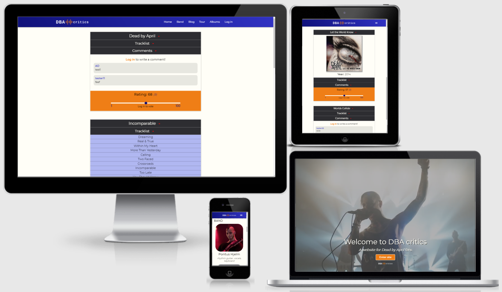

---

## Contents

- [**User Experience Design (UXD)**](#user-experience-design-uxd)

  - [Strategy](#strategy)
    - Goal
    - User stories
  - [Scope](#scope)
    - Functional specifications
    - Content requirements
  - [Structure](#structure)
    - Information architecture
    - Interaction design
  - [Skeleton](#skeleton)
    - Wireframes
  - [Surface](#surface)
    - Colours
    - Typography
    - Uniformity

- [**Features**](#features)

  - Existing features
  - Future features

- [**Database schema**](#database-schema)

- [**Technologies**](#technologies)

  - Languages
  - Frameworks
  - Libraries
  - Software

- [**Testing**](#testing)

- [**Deployment**](#deployment)

  - Hosting online
  - Running locally

- [**Credits**](#credits)

  - Code
  - Text
  - Media
  - Miscellaneous
  - Acknowledgements

- [**Notes**](#notes)

---

## User experience design (UXD)

### Strategy

#### Goal

The goal for the website is to provide fans of the band Dead by April with some general information, as well as a place to rate and discuss their album discography.

#### User stories

- As a **visitor**, I would like **to see an overview of the upcoming tour**, so that **I know where and when the next concerts take place**.

- As a **visitor**, I would like **to rate albums**, so that **I can compare the ratings with other fans**.

- As a **visitor**, I would like **to discuss albums**, so that **I can share my thoughts with other fans**.

- As a **site owner**, I would like our website **to have an intuitive navigation system**, so that **visitors can easily find what they are looking for**.

- As a **site owner**, I would like **to prevent unique visitors from voting twice**, so that **album ratings can't easily be cheated**.

### Scope

#### Functional specifications

The website should have navigation to switch between the different sections of the homepage and to navigate to other pages, such as the album or the login page. There should be buttons that link to external websites, such as concert ticket sellers. Content on the website should support different screen sizes. Wherever appropriate and or possible, visible indicators should be shown to users when they can perform an action on the website (like clicking a link or a button).

#### Content requirements

The website should display information on current band members. The website should provide links to the official Dead by April blog. The website should display a tour schedule and provide links to purchase concert tickets. The website should display album information. The website should provide the option to rate albums. The website should provide the option to discuss or comment on albums. The website should provide links to the official Dead by April social media channels.

### Structure

#### Information architecture

The website has a landing page with a button to the actual homepage. On the homepage there are 4 different sections to navigate to: welcome, band, blog, and tour. On the homepage visitors can also navigate to an album page and a login page.

#### Interaction design

Depending on their device, users could see through visible indicators like changes of colour and/or changing mouse pointers whether something is clickable. Icons such as an arrow pointing down indicate to users that an element can be expanded. Users with touchscreens can swipe up and down to scroll through the page, and they can (double)tap to select buttons and navigation elements. No audio will be used in this website.

### Skeleton

On large screen sizes the logo will be displayed on the left in the navbar and all the navigation links are on the right. On medium to small screen sizes the logo will be displayed in the center of the navbar and on the right will be a hamburger menu icon. On both the homepage and the albums page a footer will be displayed at the bottom of the page on all screen sizes. The footer will contain social media icons with links. In the home section of the homepage there will be some paragraphs with titles displayed below each other on all screen sizes. There will be an image separating each section of the homepage on all screen sizes. In the band section of the homepage there will be an image displayed and some information next to it for each band member on large and medium screen sizes, on small screen sizes this information will be displayed below the image. In the blog section of the homepage there will be two blogs next to each other on large screen sizes, on medium and small screen sizes the blogs will be below each other. In the tour section of the homepage there will be event information containers displayed below each other on all screen sizes. On the albums page an expandable collapsible will be displayed for each album in the center of the screen on all screen sizes. The first collapsible contains the album title and the body contains an image of the album cover and some general information. The second collapsible contains a tracklist. The third collapsible contains a comment section unique to each album. At the bottom of each set of album collapsibles some kind of rating system will be displayed.

#### Wireframes

To see all the wireframes in a single PDF [click here](wireframes/dba-critics-wireframes-pdf.pdf).

To see separate PNG image files of the wireframes check the wireframes folder.

### Surface

#### Colours

The first thing that came to my mind was to use a dark type of blue for this project, I think that would go well with some kind of off-white colour. I also plan to experiment with some linear gradients, so I would also need a lighter type of blue to go with the dark blue. Some kind of colour that pops could be very useful too, my initial thought is to go with some kind of orange or yellow, but I might decide to change this later.

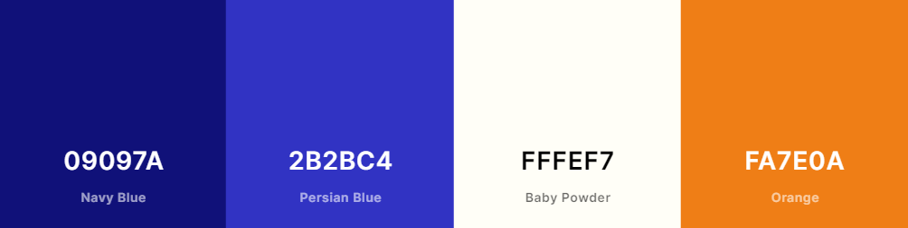

#### Typography

From my experience with previous projects I like the font-style 'Montserrat' from the Google Fonts library, it looks clean and professional, and it's a very readable font-style. I don't think I will be needing more than one font-style, but if I do, I will make sure to add that here later.

#### Uniformity

To keep the website looking uniform I will do my best to make sure that all related contents throughout the website are consistent in font size and styling. The positioning of elements and contents should be consistent in height, padding and spacing. I'm also using either grid, flexbox or both to present the content in a logical order, either through custom CSS or through the Materialize framework.

**_[Back to top](#contents)_**

---

## Features

### Existing features

#### General features

**Top navigation bar**:

- Will always be visible at the top of every page, except for the landing page.
- Has a clickable logo on either the left side or in the center that returns the user to the homepage.
- On the right side it has internal links to each separate section of the homepage, as well as internal links to the albums page and login page. When a user is logged in there will also be a logout option displayed.
- It will be fully responsive in the sense that it will shrink on smaller screen sizes and eventually collapse into a hamburger menu icon.

**Mobile side navigation**:

- Will visible at the left of every page after clicking the hamburger menu icon, except for the landing page.
- Has internal links to each separate section of the homepage, as well as internal links to the albums page and login page. When a user is logged in there will also be a logout option displayed.

**Footer**:

- Will always be visible at the bottom of every page, except for the landing page.
- Has social media icons with external links to the official Dead by April social media channels.

#### Page specific features

**Landing page**:

- Displays a welcome message in the center bottom and provides a button with an internal link to the homepage.
- Has a full screen video playing in the background on loop without sound.

**Homepage**:

- Has 4 separate sections: home, band, blog, and tour.
- Each section is separated with a (parallax) image.
- The home section states the purpose of the website and provides the visitor with some general information about the band Dead by April.
- The band section shows an image of each current band member and some information about their role in the band.
- The blog section shows a short version of some of the latest official Dead by April blogs and provides an external link to them.
- The tour section shows an overview of the Dead by April tour schedule, including dates, venue, location, and external links to ticket sellers.

**Albums page**:

- Has an expandable collapsible element for each Dead by April studio album.
- The first expandable header shows the album title and to the right is an arrow down icon to indicate to the visitor that it can be expanded.
- The body of the first expandable header contains an image of the album cover, as well as some general information of the album.
- The second expandable header says 'tracklist' and to the right is an arrow down icon to indicate to the visitor that it can be expanded.
- The body of the second expandable header contains the full tracklist of the album, including bonus and/or exclusive songs.
- The third expandable header says 'comments' and to the right is an arrow down icon to indicate to the visitor that it can be expanded.
- The body of the third expandable header contains a comment section where logged in visitors can share their thoughts about the album.
- At the bottom of each set of album collapsibles some kind of rating system will be displayed.

**Login page**:

- Has a textbox where the visitor can enter a username.
- Has a textbox where the visitor can enter a password.
- Has a button that says 'login'.
- Has an internal link to the register page for visitors who have not yet registered an account.

**Register page**:

- Has a textbox where the visitor can enter a username.
- Has a textbox where the visitor can enter a password.
- Has a button that says 'register'.

### Future features

- Adding a user profile page would be the next logical step, since it wasn't in my initial plan. On this page users could change their password and see an overview of their activities.

- Add user avatars for people to see in the comment section.

- A gallery page could be added where fans can post videos and photos of concerts they visited.

- A rating system for individual songs could be added.

**_[Back to top](#contents)_**

---

## Database schema

For this project we were required to use MongoDB as a cloud database service. In total I used 3 collections: users, comments, and ratings. In the images below you can see an overview diagram and an example of each of the collections.

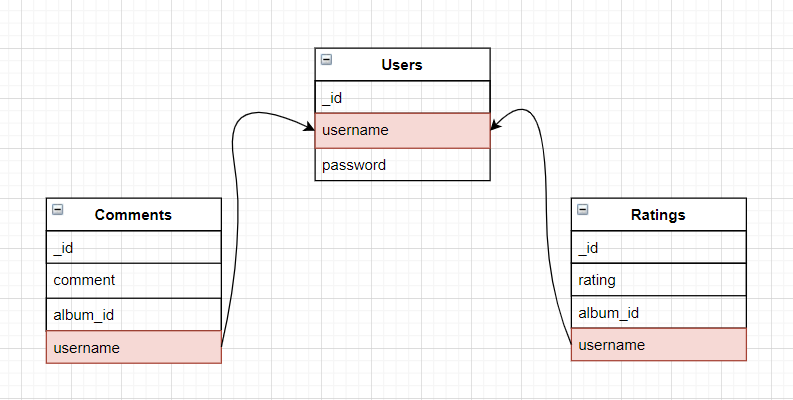

The users collection holds the \_id key, which is automatically generated by MongoDB, the username, and the password that has SHA-512 encryption.

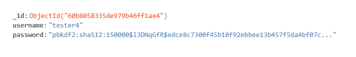

The comments collection holds the \_id key, which is automatically generated by MongoDB, the comment content, the album id, and the username.

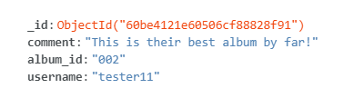

The ratings collection holds the \_id key, which is automatically generated by MongoDB, the rating (of 1 to 100), the album id, and the username.

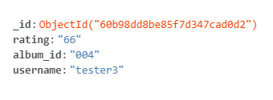

**_[Back to top](#contents)_**

---

## Technologies

### Languages

- [HTML5](https://developer.mozilla.org/en-US/docs/Web/Guide/HTML/HTML5) - for the structuring of the website.

- [CSS3](https://developer.mozilla.org/en-US/docs/Archive/CSS3) - for the styling and responsiveness of the website.

- [JavaScript](https://developer.mozilla.org/en-US/docs/Web/JavaScript) - for the (interactive) functionality of the website.

- [Python](https://www.python.org/) - for the backend functionality of the website.

### Frameworks

- [Materialize](https://materializecss.com/)

- [Flask](https://flask.palletsprojects.com/en/2.0.x/)

### Libraries

- [Google Fonts](https://fonts.google.com/) - for the Montserrat font-family.

- [Font Awesome](https://fontawesome.com/) - for multiple icons.

### Databases

- [MongoDB](https://www.mongodb.com/)

### Software

- [Balsamiq](https://balsamiq.com/) - for creating the wireframes.

- [Visual Studio Code (desktop version)](https://code.visualstudio.com/) - for coding and creating the project.

- [Git (BASH)](https://gitforwindows.org/) - for version control in the VSCode terminal.

- [Google Chrome](https://www.google.com/chrome/) - for testing the website with their devtools.

- [DaVinci Resolve 17](https://www.blackmagicdesign.com/products/davinciresolve/) - for cutting and editing the welcome page video.

**_[Back to top](#contents)_**

---

## Testing

A separate file with testing information can be found [here](file-location-placeholder).

**_[Back to top](#contents)_**

---

## Deployment

### Set up database

To deploy this project yourself you will need to set up a database with the following steps:

1. Sign up to [MongoDB](https://account.mongodb.com/account/register).
2. Select the option to create a free cluster.
3. Choose a cloud provider, region, and a cluster name.
4. Click **connect**.

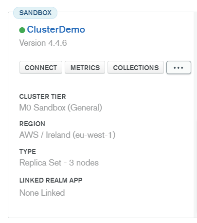

6. Add your IP address to the whitelist.
7. Create a database username and password.
8. Click **choose a connection method**.
9. Select **connect your application**.
10. Select the correct driver (Python) and version.
11. Copy the connection string (you will need this MONGO_URI later), and follow the instructions to replace the password and database name.
12. Go back to your cluster and click **collections**.
13. Choose a database name.
14. Re-create my **users**, **ratings**, and **comments** collections according to my [**database schema**](#database-schema).

### Hosting online

This project was hosted on [Heroku](https://dashboard.heroku.com/) with the following steps:

1. First of all you need to clone my repo and add it to your own Github acount.
2. Log into [Heroku](https://id.heroku.com/login).
3. Select **new** and **create new app**.

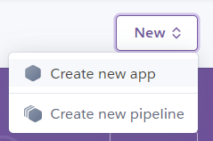

4. Choose a unique app name and select a region.
5. Click **connect to github**.
6. Enter your repo name and click search.
7. Click **connect**.
8. Scroll up and click on the **settings** tab.

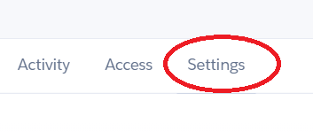

9. Click **reveal config vars**.
10. Add the correct environment variables.

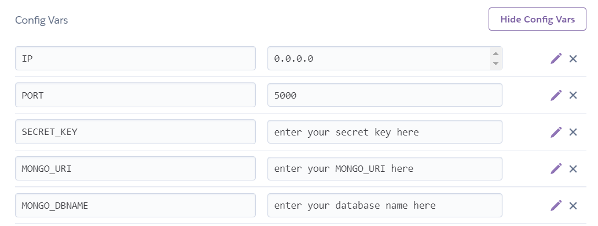

11. In your repo folder create an **env.py** file.
12. In the env.py file copy and paste the following code, and make sure to match the config vars values that you entered in Heroku earlier:

```
import os

os.environ.setdefault("IP", "0.0.0.0")
os.environ.setdefault("PORT", "5000")
os.environ.setdefault("SECRET_KEY", "enter your database name here")
os.environ.setdefault("MONGO_URI", "enter your MONGO_URI here")
os.environ.setdefault("MONGO_DBNAME", "enter your secret key here")

```

13. Add both `env.py and __pycache__/` to a .gitignore file (both on separate lines).

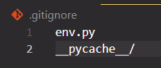

14. In your terminal enter the following command: `pip3 install Flask`
15. Commit these changes to Github.
16. Go back to the Heroku website, scroll up and click the **deploy** tab.

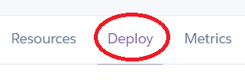

17. In the deploy tab, scroll down and click **enable automatic deploys**
18. At the **deploy a github branch** select the main/master branch and click **deploy branch**.
19. Heroku will now receive the code from your GitHub repo, and start building the app using the required packages. This could take a couple minutes, once it's done, you'll also see "Your app was successfully deployed."
20. Click **view** to launch your new app.
21. The deployed site is now available, and should automatically update whenever you push changes to the Github repo.

### Running locally

To run my project locally I'd suggest the following steps:

1. First of all, set up a database in MongoDB as described earlier in this section of the readme.
2. Download and install the appropriate versions of Python, Visual Studio Code, and GIT for your computer.
3. Download the repo from my Github and extract it in a folder on your computer.
4. Open this folder in Visual Studio Code.
5. In your terminal, make sure you are in the root directory and enter the following command: `pip3 install -r requirements.txt`
6. In your project folder create an **env.py** file.
7. In the env.py file copy and paste the following code, and make sure to enter your own secret key, MONGO_URI, and database name:

```
import os

os.environ.setdefault("IP", "0.0.0.0")
os.environ.setdefault("PORT", "5000")
os.environ.setdefault("SECRET_KEY", "enter your database name here")
os.environ.setdefault("MONGO_URI", "enter your MONGO_URI here")
os.environ.setdefault("MONGO_DBNAME", "enter your secret key here")

```

8. If you plan to push this project to your own Github, make sure to add both `env.py and __pycache__/` to a .gitignore file (both on separate lines).


9. To run the application locally, in your terminal enter the following command: `py app.py`
10. To visit the website, enter the following URL in a browser of your choice: `http://localhost:5000/`

**_[Back to top](#contents)_**

---

## Credits

placeholder text

### Code

placeholder text

### Miscellaneous

placeholder text

### Acknowledgements

placeholder text

**_[Back to top](#contents)_**

---

## Notes

placeholder text

**_[Back to top](#contents)_**

---
