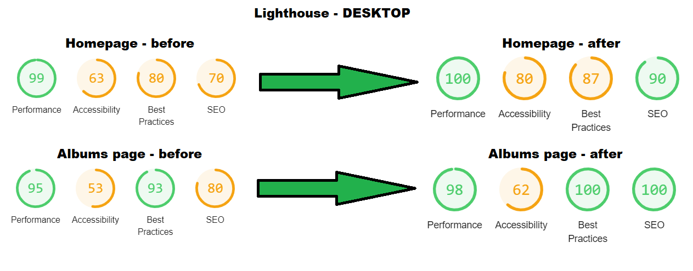
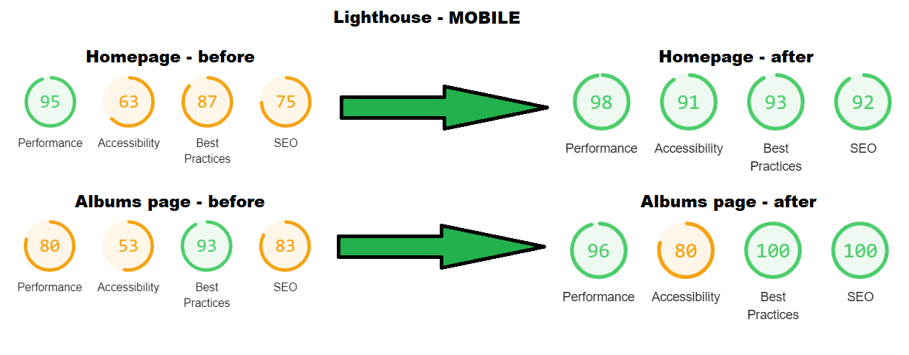
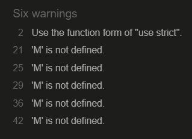
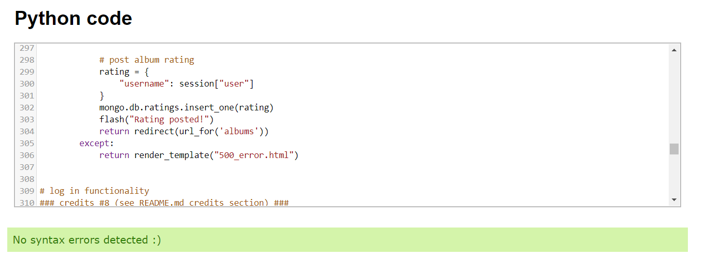
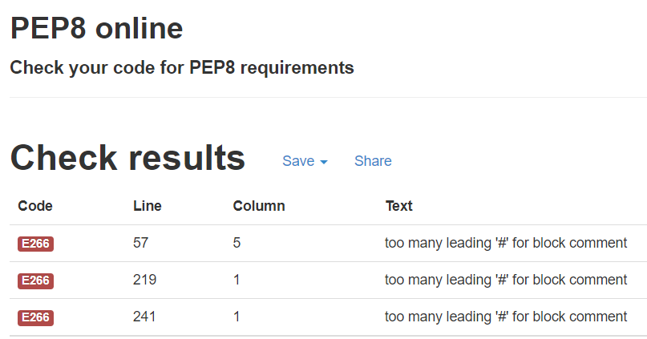

# Testing

View live version of the website [here](http://dba-critics.herokuapp.com/).

Milestone Project 3: Python and Data Centric Development – [Code Institute](https://codeinstitute.net/)

In this document you will find information about the testing procedures that I have used to make sure the website displays and functions correctly on most browsers and devices.

---

## Contents

- [**Browser compatibility**](#browser-compatibility)

  - Tested browsers and devices
  - What I tested
  - Browser compatibility testing results

- [**Mobile responsiveness**](#mobile-responsiveness)

- [**Lighthouse**](#lighthouse)

- [**Code validators**](#code-validators)

  - W3C - Markup Validation Service
  - W3C - CSS Validation Service
  - JSHint - JavaScript code quality checker
  - Python checker - Python code syntax checker
  - PEP8 online - Python code style checker

- [**Test cases**](#test-cases)

- [**Testing user stories**](#testing-user-stories)

- [**Bugs**](#bugs)

  - Solved bugs
  - Known bugs

---

## Browser compatibility

### Tested browsers and devices

I tested these browser versions on these devices:

**Desktop PC (64-bit, Windows 10):**

- Google Chrome Version 91.0.4472.77 (Official Build) (64-bit)
- Firefox Version 89.0 (64-bit)
- Microsoft Edge Version 91.0.864.41 (Official build) (64-bit)
- iOS (via https://www.browserstack.com/)

**Dell E7240 laptop (64-bit, Windows 10):**

- Opera Version 77.0.4054.60 (64-bit)

**Samsung Galaxy S7 (Android Version 8.0.0):**

- Samsung internet Version 13.2.2.4
- Brave Browser Version 1.23.76

### What I tested

List of things that I tested:

- If elements display correctly in size and order
- If images display correctly
- If all the (internal) links work
- If hover effects work
- If the JavaScript functionality works
- If the Python functionality works
- In general I tested the entire website, to see if it displayed and worked as intended.

### Browser compatibility testing results

**Google Chrome Version 91.0.4472.77 (Official Build) (64-bit):**

Everything is working and displaying as intended. [(screenshot)](testing-img/chrome.png)

**Firefox Version 89.0 (64-bit):**

Everything is working and displaying as intended. [(screenshot)](testing-img/firefox.png)

**Microsoft Edge Version 91.0.864.41 (Official build) (64-bit):**

Everything is working and displaying as intended. [(screenshot)](testing-img/edge.png)

**iOS:**

I've tested a couple of iOS 12 and 13 devices on [Browserstack](https://www.browserstack.com/). When I wasn't logged in there weren't any issues as you can see using this [iPhone 11 Pro](testing-img/iphone11pro.png) with iOS 13, the entire website displayed correctly. When I logged in there was a small display issue on the albums page, as you can see on this [iPad Air 2019](testing-img/ipadair2019.png) with iOS 13. The submit button was only half visible, but it was still clickable and functioning. The same issue occured when I tested an iPhone 8 with iOS 12, but the rest of the website had no issues, things like [the mobile navigation menu](testing-img/iphone8.png) all displayed correctly. Unfortunately I wasn't allowed to test any iOS 14 devices this time, but from previous experience it's likely that iOS 14 devices are performing equal if not better than older iOS devices, so I expect no major issues there.

**Opera Version 77.0.4054.60 (64-bit):**

Smooth scroll didn't work at first, but it turned out to be a browser setting similar to Google Chrome. So everything is working and displaying as intended. [(screenshot)](testing-img/opera.png)

**Samsung internet Version 13.2.2.4:**

Everything is working and displaying as intended. [(screenshot)](testing-img/samsung.jpg)

**Brave Browser Version 1.23.76:**

Everything is working and displaying as intended. [(screenshot)](testing-img/brave.jpg)

**_[Back to top](#contents)_**

---

## Mobile responsiveness

I've applied completely custom media queries throughout the website to achieve mobile responsiveness. To test the website for mobile responsiveness I've been using the Google Chrome devtools throughout the coding of the media queries. I manually used the sliders to adjust for different screen sizes, and I've also used all of the [pre-configured screen sizes](testing-img/devtools-phones.png) in the devtools to test if things looked okay, both in vertical and horizontal directions. Since the early stages of development I've also tested parts of the website on my Galaxy S7, this was possible because I deployed the website to Heroku at the beginning of the development process. Another thing I did was use [responsive design checker](https://responsivedesignchecker.com/) and [ami responsive design](http://ami.responsivedesign.is/) for some additional mobile responsiveness testing throughout the building of the website, since the Google Chrome devtools can behave a bit strange at times it's good to test responsiveness with more than a single tool.

**_[Back to top](#contents)_**

---

## Lighthouse

In the Google Chrome devtools I have used the Lighthouse feature to check: performance, accessibility, best practices and SEO indicators for my website. I recorded before and after scores of the desktop and mobile tests of both the homepage and albums page. Some test scores deviated between 1 and 6 points without making changes to the website, so take that into consideration. The images below this paragraph show the scores before making changes to my website, and the best scores that I've managed to achieve after making some recommended changes. I improved the performance score by: compressing and/or optimizing videos and images, adding SEO tags and a website description, and by adding aria labels and alt tags. During testing with Lighthouse is became obvious to me that using the Materialize framework and Flask with its Jinja templating caused a lot of errors or warnings resulting in lower scores, especially in accessibility.

**_[Back to top](#contents)_**

---

## Code validators

### W3C - Markup Validation Service

I've put the HTML code through the [W3C markup validator](https://validator.w3.org/), and I only got Flask/Jinja related errors that should be ignored.

### W3C - CSS Validation Service

I've put my style.css file through the [W3C CSS validator](https://jigsaw.w3.org/css-validator/) and it [passed without errors](testing-img/css-validation.png) on the second try, after removing some unnecessary background styling.

### JSHint - JavaScript code quality checker

I've put my script.js file through the [JSHint validator](https://jshint.com/) and it gave some warnings about missing a few semicolons. After adding those, I only got 1 ignorable warning about use strict, and 5 ignorable warnings related to some Materialize code.

### Python checker - Python code syntax checker

I've checked my Python code syntax on the [extendsclass website](https://extendsclass.com/python-tester.html), and after removing the f-strings that gave errors (because I couldn't select my Python version and this checker is apparently not up to date with Python 3.6 or 3.9) I got no errors at all.

### PEP8 online - Python code style checker

I've checked my Python code style to fit the PEP8 guidelines on the [PEP8online website](http://pep8online.com/), and after pushing down some lines of code that were too long I was only left with ignorable warnings for using multiple hashtags in a comment. I chose to do this to make my credits stand out against regular comments.

**_[Back to top](#contents)_**

---

## Test cases

placeholder text

**_[Back to top](#contents)_**

---

## Testing user stories

placeholder text

**_[Back to top](#contents)_**

---

## Bugs

### Solved bugs

placeholder text

### Known bugs

placeholder text

**_[Back to top](#contents)_**

---
